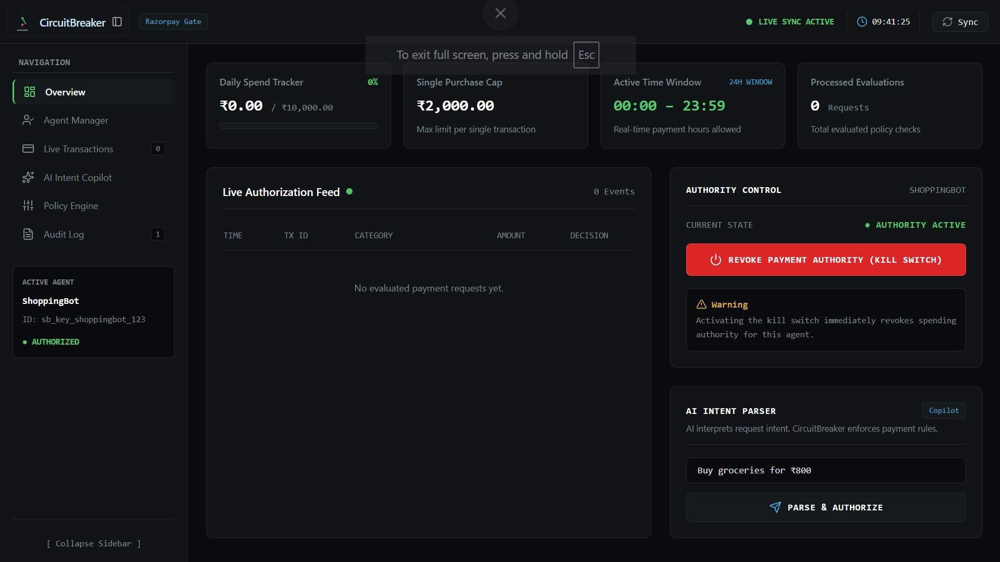
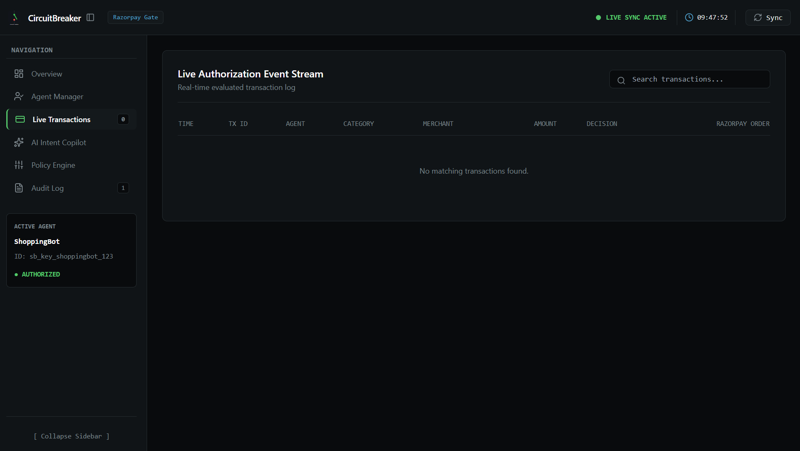
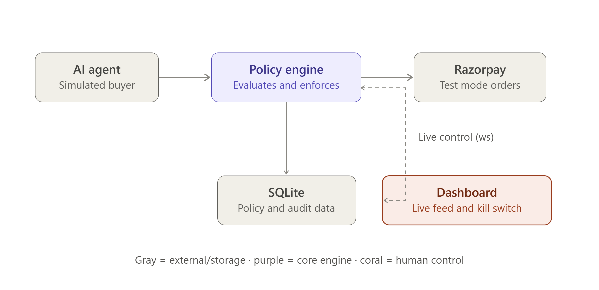
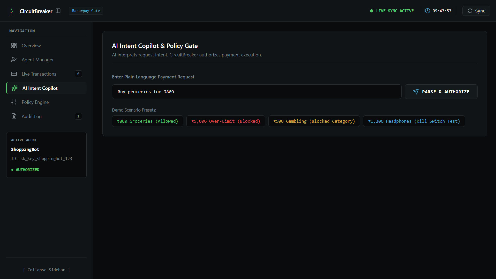
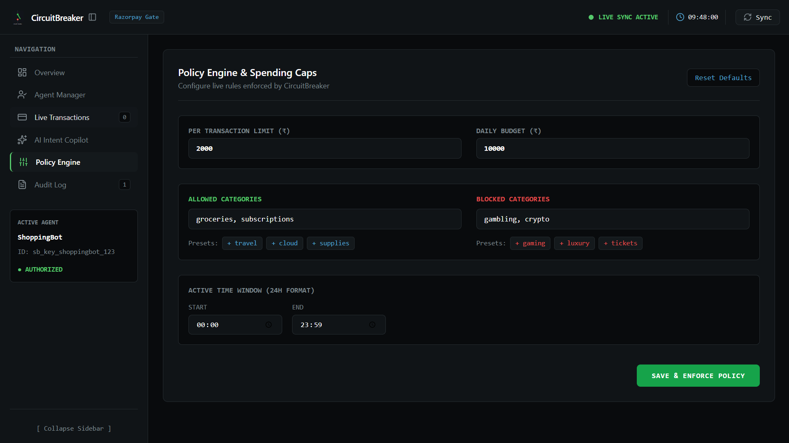
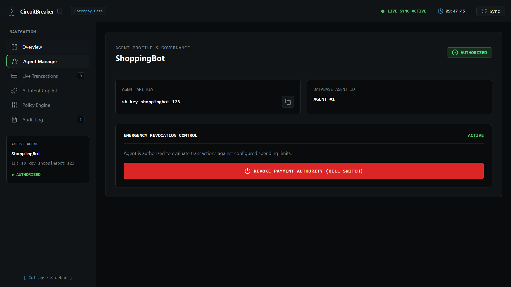
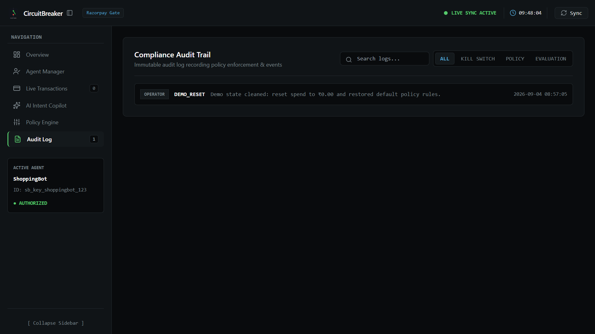

# CircuitBreaker

**Agent Authorization & Payment Policy Enforcement Layer**
*Razorpay AI Buildathon 2026 — Open Track*

---

## 1. Project
CircuitBreaker gives humans a real-time authorization boundary between autonomous AI agents and real-world payments.

## 2. Problem

AI agents are moving from answering questions to taking real actions — Visa Intelligent Commerce, Mastercard Agent Pay, and OpenAI Instant Checkout are already live. Once an agent can spend autonomously, humans need a way to control what it's allowed to buy, and a way to shut it off instantly if it misbehaves. Payment infrastructure today still assumes a human clicks "Pay" — there's no standard layer for scoping, monitoring, or revoking an AI agent's spending authority in real time.

## 3. What CircuitBreaker does

CircuitBreaker sits between an autonomous AI agent and Razorpay. Every transaction attempt is evaluated in real time against a configurable policy — spend limits, category allow/block lists, and time windows — before a Razorpay order is ever created. A human operator can edit that policy or hit a kill switch from a live dashboard, and the very next transaction attempt reflects the change instantly.

## 4. Demo


*Figure 1: Control Dashboard — Daily Spend Tracker, Single Purchase Cap, Active Window, and Evaluated Requests.*


*Figure 2: Live Transaction Stream — Real-Time Decision Pills (ALLOWED / BLOCKED) and Razorpay Order ID Copy.*

Run these four scenarios against a fresh agent to see the full range of behavior:

| Scenario | Amount / category | Expected result |
|---|---|---|
| Normal | ₹800, groceries | ALLOWED — real Razorpay test order created |
| Over-limit | ₹5,000, groceries | BLOCKED — exceeds per-transaction limit |
| Blocked category | ₹700, gambling | BLOCKED — category not permitted |
| Kill switch | any, mid-loop | BLOCKED the instant kill is triggered — "agent is KILLED" |

See [Section 14](#14-running-the-demo) for exact commands.

## 5. Architecture


*Figure 3: System Architecture — Real-Time Payment Authorization & Policy Enforcement Flow.*

```
   [ AI agent (simulator CLI) ]
                 │
                 │ POST /agents/{id}/transact
                 ▼
     [ CircuitBreaker API ] ──(BLOCKED)──► [ Audit log & DB ]
                 │
             (ALLOWED)
                 │
                 ▼
     [ Razorpay order created ]
                 │
                 ▼
     [ Live WebSocket broadcast ] ──► [ Operator dashboard UI ]
```

The agent never talks to Razorpay directly — every attempt must pass through the policy engine first. That's what makes the kill switch meaningful: there's exactly one path to a real payment, and it's the path CircuitBreaker controls.

## 6. AI intent layer


*Figure 4: AI Intent Copilot — Natural Language Payment Intent Parsing & Policy Evaluation Preview.*

Each transaction request from the agent (`amount`, `category`, `merchant`) represents the agent's stated purchase intent — the "what and why" it's trying to buy. CircuitBreaker treats this intent as untrusted input: it doesn't matter how the agent arrived at the decision to buy something, only whether that specific intent is authorized under the current policy at the moment it's submitted. This is a deliberate boundary — the policy engine evaluates the intent's shape (amount/category/timing), not the agent's internal reasoning, keeping the enforcement layer simple, auditable, and decoupled from whatever model or logic drives the agent itself.

## 7. Policy engine


*Figure 5: Policy Engine — Live Rule Management, Spend Caps, and Category Allow/Block Lists.*

The core logic lives in `backend/policy_engine.py` as a pure, dependency-free function — no HTTP or DB code — so it's independently testable. Rules are evaluated in order, and the first failing rule determines the outcome:

1. Agent status is `KILLED` or `PAUSED` → blocked
2. Category is in `blocked_categories` → blocked
3. `allowed_categories` is set and category isn't in it → blocked
4. Amount exceeds `per_transaction_limit` → blocked
5. Amount would push today's spend over `daily_budget` → blocked
6. Outside the configured active time window → blocked
7. Otherwise → allowed, and a real Razorpay test order is created

Every evaluation — allowed or blocked — writes a Transaction row and an AuditEvent row, and is pushed live over WebSocket.

## 8. Razorpay integration

Allowed transactions create a real order via the Razorpay Orders API in **test mode**, using the official Python SDK. API keys are read from environment variables only — never hardcoded — via a `.env` file (see [Section 13](#13-setup)). If the Razorpay call fails after a transaction was already marked ALLOWED, that failure is recorded explicitly on the Transaction row rather than silently reported as a success.

## 9. Kill switch


*Figure 6: Agent Manager — Emergency Authority Switch & Live Agent Status Controls.*

An operator can revoke an agent's spending authority instantly from the dashboard, or via CLI:

```bash
python simulator/agent_sim.py --action kill
python simulator/agent_sim.py --action resume
```

Kill sets the agent's policy status to `KILLED` and is broadcast over WebSocket immediately. It doesn't attempt to cancel an in-flight Razorpay call — it blocks the *next* transaction attempt onward, which is the guarantee the system actually makes.

## 10. Audit trail


*Figure 7: Audit Log — Immutable Event History & Policy Change Tracking.*

Every policy change, kill/resume toggle, and transaction evaluation writes a human-readable AuditEvent (not raw JSON) — visible via the dashboard's audit log or `GET /agents/:id/audit`. Policy updates insert a new version rather than overwriting the previous one, so past transactions can be traced back to the exact policy that was active when they were evaluated.

## 11. Tech stack

- **Backend:** FastAPI, SQLite, SQLAlchemy 2.0, Razorpay Python SDK
- **Frontend:** React 19, Vite 8, Tailwind CSS
- **Realtime:** native FastAPI WebSockets
- **Policy engine:** pure Python, no framework dependencies (`backend/policy_engine.py`)

## 12. Project structure

```
circuit-breaker/
├── backend/
│   ├── main.py
│   ├── models.py
│   ├── policy_engine.py
│   ├── razorpay_client.py
│   ├── ws_manager.py
│   └── tests/
├── frontend/
│   └── src/
├── simulator/
│   └── agent_sim.py
├── .env.example
└── README.md
```

## 13. Setup

### Prerequisites
- Python 3.11+
- Node.js 18+
- A Razorpay account with test-mode API keys

### Backend
```bash
cd backend
python -m venv venv
```

Activate the virtual environment:

**PowerShell:**
```powershell
.\venv\Scripts\Activate.ps1
```
*(If PowerShell restricts scripts, run `Set-ExecutionPolicy -ExecutionPolicy RemoteSigned -Scope Process` first.)*

**Command Prompt (CMD):**
```cmd
venv\Scripts\activate.bat
```

**Git Bash / Bash:**
```bash
source venv/Scripts/activate
```

Then:
```bash
pip install -r requirements.txt
cp .env.example .env   # fill in your Razorpay test keys
```

### Frontend
```bash
cd frontend
npm install
```

## 14. Running the demo

**Terminal 1 — backend:**
```bash
python -m uvicorn backend.main:app --reload --port 8000
```
- API base URL: `http://127.0.0.1:8000`
- Interactive docs: `http://127.0.0.1:8000/docs`
- WebSocket endpoint: `ws://127.0.0.1:8000/ws/agents/1`

**Terminal 2 — frontend:**
```bash
cd frontend
npm run dev
```
Open `http://localhost:5173` (or the URL Vite prints).

**Terminal 3 — simulator** (activate venv first):
```bash
python simulator/agent_sim.py --scenario normal
python simulator/agent_sim.py --scenario over-limit
python simulator/agent_sim.py --scenario blocked-category
python simulator/agent_sim.py --scenario loop --interval 3.0
```

While the loop is running, trigger the kill switch from the dashboard or via:
```bash
python simulator/agent_sim.py --action kill
python simulator/agent_sim.py --action resume
```

## 15. Test scenarios

| Command | Expected outcome |
|---|---|
| `--scenario normal` | ₹800 groceries → ALLOWED, real Razorpay order ID returned |
| `--scenario over-limit` | ₹5,000 groceries → BLOCKED, reason: exceeds per-transaction limit |
| `--scenario blocked-category` | ₹700 gambling → BLOCKED, reason: category not permitted |
| `--scenario loop --interval 3.0` | Mixed transactions every 3s — use to demo live kill switch |
| `--action status` | Prints current agent status and active policy |
| `--action reset-policy` | Restores the agent's policy to its initial defaults |

Automated tests:
```bash
python -m pytest backend/tests
```
Covers each policy rule individually plus a valid-transaction pass, run directly against `policy_engine.py` with no HTTP/DB dependencies.

## 16. Engineering decisions

- **Policy engine is a pure function**, isolated from FastAPI route handlers, so the core business logic is deterministic and testable in isolation from the web layer.
- **The agent has no direct path to Razorpay** — every transaction must go through the policy engine, or the enforcement guarantee would be meaningless.
- **Policies are versioned, not overwritten**, so the audit trail can always show which rules were active for any past decision.
- **WebSockets over polling** — kill-switch and transaction outcomes need to appear on the dashboard instantly; that immediacy is core to the product, not a nice-to-have.
- **SQLite for the prototype** — zero setup, file-based, appropriate for current state; see [Section 17](#17-production-considerations) for what changes at scale.

## 17. Production considerations

What CircuitBreaker would need beyond this prototype:
- **Persistence:** SQLite → Postgres with proper connection pooling
- **Agent identity:** API key → signed, verifiable agent credentials (not a shared secret)
- **Idempotency:** duplicate transaction requests should be deduplicated via an idempotency key (`agent_id + request_id`) to prevent double-charging
- **Risk model:** static rule-based policy → a risk-scoring layer that can flag anomalous agent behavior beyond simple limit checks
- **Scale:** single-agent demo → fleet management across many agents and operators
- **Resilience:** the policy engine itself is stateless and horizontally scalable; state (policy, audit, transactions) would move to centralized, replicated storage


## 18. License

Apache License 2.0
